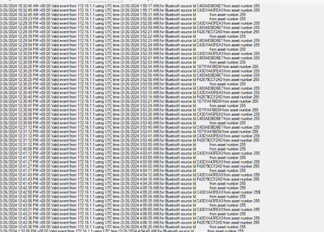
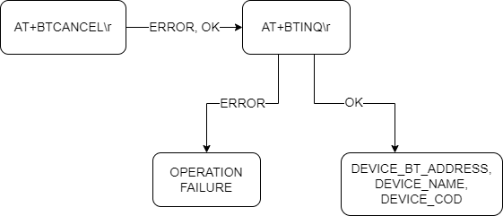
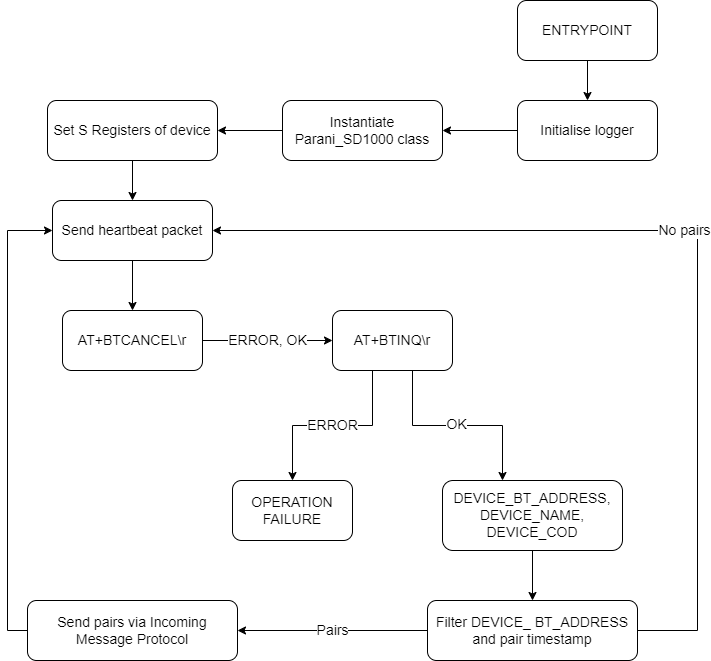
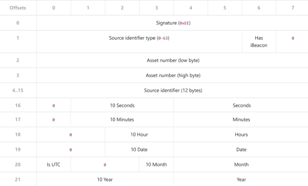

# IOx-hosted Parani SD1000 Bluetooth Scanner

Utilising the PySerial library, AT commands are sent to the Parani SD1000 over RS232 connection. A specialised RJ45-to-DB9 adapter is required for use on the native serial port (which is DTE) of the IR1101.

The current implementation successfully collects the Bluetooth MAC addresses of nearby devices via an Inquiry scan using the Parani dongle. Each recorded MAC address is paired with an accurate timestamp, given immediately after the address is detected. 

After the Inquiry scan is completed (i.e. a binary “OK\r\n” is read from the serial connection at end of scan), the collected MAC address, timestamp pairs are normalised into specialised 22-byte packets (Incoming Message Protocol). These packets are then sent to the test server, a third-party application developed by AddInsight. The image below showcases an expected output seen from the test server.



## Adapter Pinouts
Parani DCE to IR1101 DTE

| Parani DB9 | IR1101 RJ45 | Adapter RJ45 colour |
|------------|-------------|---------------------|
| 1          | 2           | Orange              |
| 2          | 5           | Green               |
| 3          | 6           | Yellow              |
| 4          | 3           | Black               |
| 5          | 4           | Red                 |
| 6          | 1           | Blue                |
| 7          | 8           | White               |
| 8          | 7           | Brown               |
| 9          | N/A         | N/A                 |

## IR1101 Configuration SETUP, REQS, DHCP FOR DYNAMIC ADDRESSING, ETC

### Setting up IOx

The cisco:cisco credentials are used when logging into the web-based GUI of IOx.

``` ios-xe
router(config)# iox
router(config)# ip http server
router(config)# ip http secure-server
router(config)# username cisco privilege 15 password 0 cisco
```

### Relaying Async interface to IOx

Tunnels the async interface into the IOx subsystem for usage by application.

``` ios-xe
router(config)# relay line 0/2/0 0/0/0
```

### App Hosting Networking

The g0/0/0 interface is WAN port, could be static addressing.

``` ios-xe
router(config)# ip routing
router(config)# int g0/0/0
router(config-if)# ip address dhcp

router(config)# int virtualportgroup 0
router(config-if)# ip address 172.16.1.1 255.255.255.0
router(config)# app-hosting appid parani
router(config-app-hosting)# app-vnic gateway0 virtualportgroup 0 guest-interface 0
router(config-app-hosting-gateway0)# guest-ipaddress 172.16.1.2 netmask 255.255.255.0
router(config-app-hosting)# app-default-gateway 172.16.1.1 guest-interface 0
```

### Dynamic App Addressing Assignment via DHCP

``` ios-xe
router(config)# ip dhcp pool parani
router(dhcp-config)# network 172.16.1.0 255.255.255.0
router(dhcp-config)# default-router 172.16.1.1
router(dhcp-config)# domain-name router.local
router(dhcp-config)# dns-server 1.1.1.1 8.8.8.8
```

## Design of Software Functionality

The original AT command state machine is quite primitive but fully achieves the goal of putting the device's state into Standby, and capturing the surrounding device's Bluetooth MAC addresses.



However, this is only a glance into the final flow of the software, as more features have been added since this initial design of the process. A full insight into the workings of the software can be seen below. Excluded logging of the phases for brevity sake.



## Protocols

The transmission of the Bluetooth MAC addresses and timestamp pairs require a specialised 22-byte long packet format to be crafted and packed. A pair can only be transmitted via a single packet, i.e. there are no chaining of records into a single packet. The name of this packet is the Incoming Message Protocol, its responsiblility is to structure the data for the external server-side processing.



There is also a heartbeat packet, in which the Bluetooth MAC address is set to twelve ASCII space characters. This is used in times of low traffic, as an error-checking mechanism to ensure the hardware device has not become faulty and is still functioning as expected. This is sent every 15 seconds at the start of the loop's execution.

## Issues
- Memory usage is relatively high (~200 MB) due to the required Python runtime
- The buffer is not cleared when calling the defined methods in the PySerial library. This is mitigated with the 0.1 second read timeout of the Parani_SD1000.bt_cancel() method, but adds a small delay.
- Logging is entirely informational in this version, except for a single critical error upon serial line opening failure.